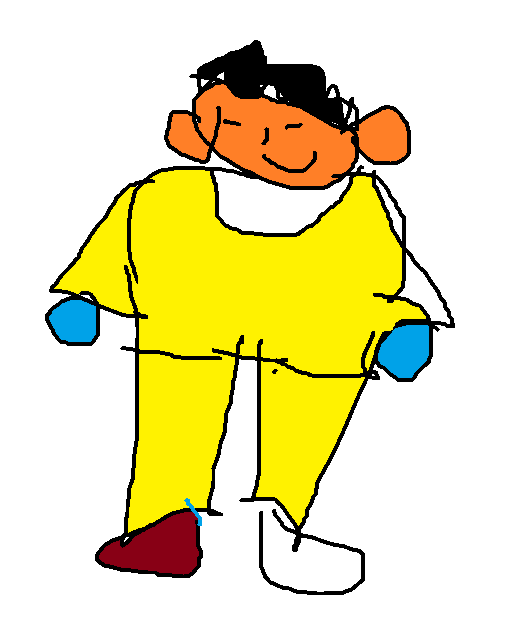

# les5
dit is een oefening

## test

* dit is een bullet
* dit ook
* en dit ook

1. dit eerst
2. dit daarna
3. daarna dit

[dit is mijn link](https://sjo.hosts1.ma-cloud.nl/wiskundePortfolio2017/)

# en dit is nieuw!